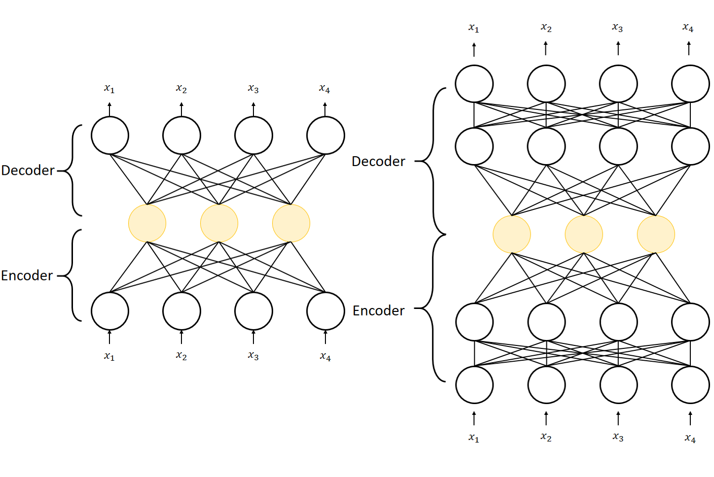

# 오토 인코더(Autoencoder)

> 출력이 입력데이터와 같아지도록 학습한 네트워크이다. (비지도 학습)
>



* 오토인코더는 인코더(Encoder)와 디코더(Decoder) 부분으로 나뉘어진다. 
* 인코더(Encoder) : 인지 네트워크(Recognition network)라고 하며, 입력을 내부 표현으로 변환
* 디코더(Decoder) : 생성 네트워크(Generative network)라고 하며, 내부 표현을 출력으로 변환 
* 오토인토더는 비지도학습(Unsupervised Learning)에 해당한다.
* 1) 차원축소, 2) 잡음제거, 3) 이상 데이터 검출, 4) 사전 학습에 사용된다.


### 1. 차원축소

위의 그림을 보면 입력 layer와 중간 노란색 layer를 사용해 차원을 축소하는데 사용한다. 

(Keras functional API 사용)

```python
xInput = Input(batch_shape=(None, nInput))
xEncoder = Dense(256, activation='relu')(xInput)
xEncoder = Dense(nFeature, activation='relu')(xInput)
yDecoder = Dense(256, activation='relu')(xEncoder)
yDecoder = Dense(nOutput, activation='linear')(yDecoder)

model = Model(xInput, yDecoder) # 학습용 모델
encoder = Model(xInput, xEncoder) # 활용 목적의 모델

model.compile(loss='mse', optimizer = Adam(lr=0.01))

# autoencoder 학습
hist = model.fit(inputX, inputX, epochs=100, batch_size=50)

# 학습된 autoencoder를 이용해 입력데이터의 차원 축소
inputXE = encoder.predict(inpuX)
# 차원이 축소된 inputXE를 다른 알고리즘에 활용한다. 
```


### 2. 잡음제거

* 이미지 데이터에 의도적으로 잡음을 삽입하고, 오토인코더를 통해 잡음이 없는 원본이미지가 나오도록 학습한다.
* 학습이 끝난 오토인코더 모델에 test set으로 잡음이 있는 이미지 데이터를 넣으면 잡음이 제거된 깨끗한 이미지를 출력한다.
* 이는 저화질의 이미지를 고화질의 이미지로 변환하는 데 유용하다.


### 참고 문헌

* [Autoencoder](https://www.cs.toronto.edu/~larocheh/publications/icml-2008-denoising-autoencoders.pdf)