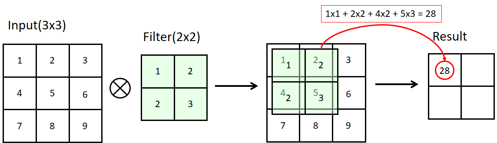
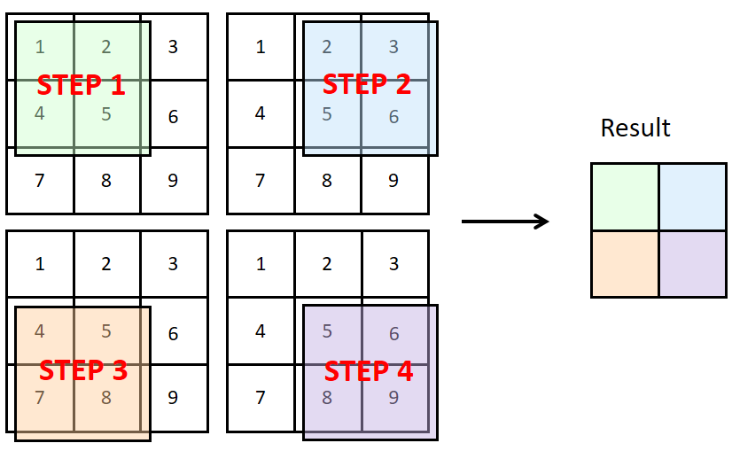
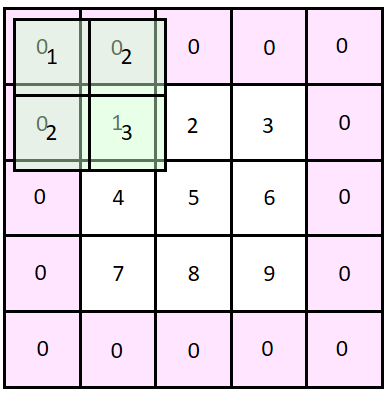
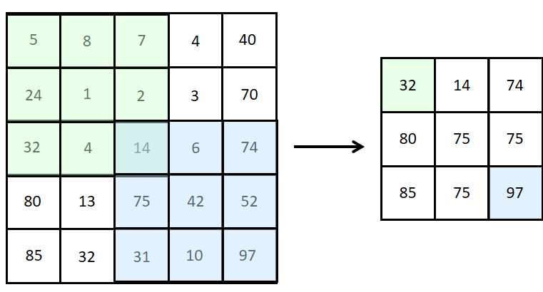
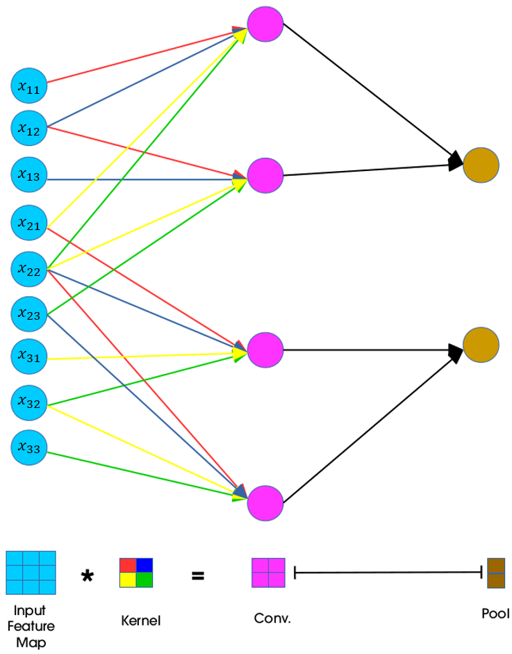

# 합성곱 신경망(CNN)

> CNN 알고리즘은 인간의 시각 정보를 인식하는 방식과 유사하게 기계가 이미지를 인식하도록 만드는 알고리즘이다. 주로 이미지 인식에 많이 사용된다.

## Convolutional Layer

* 이미지 데이터의 부분적 특징을 추출하기 위해서 filter(kernel)로 합성곱 연산을 수행하는 과정, 이를 통해 특성맵(feature map)을 생성

### cross-correlation

### stride

* filter(kernel)를 지정된 간격으로 움직이는데 이 간격을 stride라고 한다.

### padding

* Feature map의 크기를 입력 이미지와 같게하려면 이미지 외곽에 필요한만큼 zero-padding를 삽입한다.
* Feature map의 크기 조절 뿐만아니라 이미지 외곽 데이터의 특징을 살리기 위해서도 사용이 된다.

## Pooling Layer

* Feature map의 크기를 줄여주는 과정이다,

* max pooling : filter와 겹쳐지는 부분 중 가장 큰 값을 선택 (가장 많이 사용)

* average pooling : filter와 겹쳐지는 값들의 평균값

* max pooling을 사용해 특정 영역의 대표값을 선택해 해당영역을 강조하는 효과가 있다.

* pooling layer는 convolution layer처럼 weight를 갖지 않는다.

  

## Upsampling / Transposed convolution

* Upsampling / Transposed convolution은 차원을 늘리는 방법이다.
* Upsampling는 고정값 필터를 사용할 수도 있고(non-trainable), convolution layer처럼 weight와 bias를 설정하여 학습할 수도 있다.(trainable)
* 특정 부분을 강조하고 빠른 계산을 위해 Downsampling을 하고 이를 원래 이미지 크기로 복원하기 위해서 Upsampling을 사용한다. 하지만 Upsampling은 차원을 늘려줄뿐 유실된 데이터를 복원할 수는 없다.

## CNN Backpropagation

* 일반 MLP backpropagation과 원리가 같다.
* 다만 convolution layer에서의 W는 4개씩 동일한 상태로 존재한다. W0(빨간 화살표)가 4개 존재하게 된다.
* 더 자세한 설명은 [여기](https://ratsgo.github.io/deep%20learning/2017/04/05/CNNbackprop/)참고하기

## CNN의 문제점

* CNN은 이미지의 부분적인 특징을 잘 추출하지만 부분들의 관계는 인식하지 못한다.
* pooling layer를 적용하면 데이터 유실이 발생한다. (중요한 feature가 버려질 수도 있다.)

## 다양한 CNN 아키텍처

* [LeNet](http://yann.lecun.com/exdb/publis/pdf/lecun-98.pdf)
* [AlexNet](http://papers.nips.cc/paper/4824-imagenet-classification-with-deep-convolutional-neural-networks)
* [ZF Net](https://arxiv.org/abs/1311.2901)
* [GoogLeNet](https://arxiv.org/abs/1409.4842)
* [VGGNet](http://www.robots.ox.ac.uk/~vgg/research/very_deep/)
* [ResNet](https://arxiv.org/abs/1512.03385)