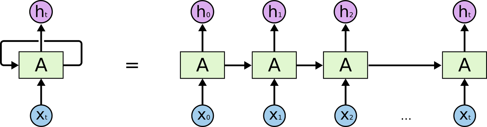
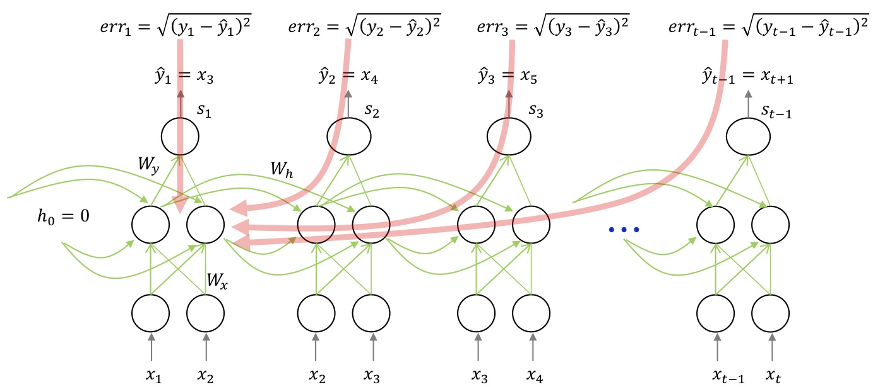
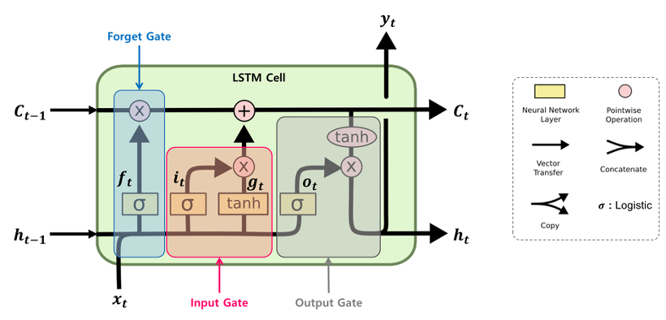
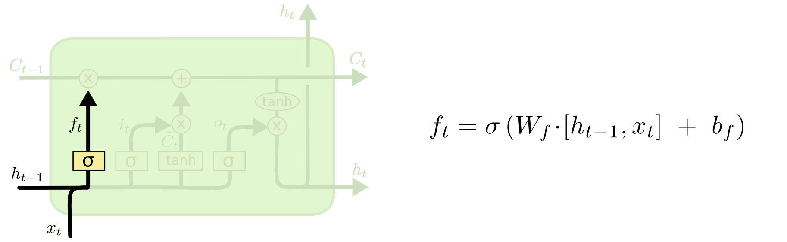

## RNN & LSTM

### 순환신경망(Recurrent Neural Network)

> 히든 노드에 대한 출력값이 다시 입력으로 연결되는 순환적인 구조를 갖는 인공신경망의 한 종류이다. 주로 음성, 문자 등 순차적인 데이터를 학습하는데 유용하다.

* 위의 사진은 rnn을 풀어 그린 그림이다.
* 순환 구조를 통해 각 스텝은 이전 상태를 기억하므로 현재 상태가 이전 상태에 종속된 구조에 활용이 가능하다.

### BPTT(Backpropagation Through Time)

* RNN은 각 스텝(t)마다 오류를 측정하여 이전 스템으로 전파한다.
* RNN도 정답이 필요하므로 정답(y)와 실제 출력값(yt_Hat)으로 error(mean square error)을 측정해 W값과 bias를 업데이트 한다.
* Rnn Backpropagation은 error가 멀리 전파될 때 계산량이 많아지고 전파되는 양이 작이지는 문제점(Vanishing gradients 문제)이 발생한다.
* Vanishing gradients 문제를 해결하기 위해서 error을 몇 스텝까지만 전파시키는 방법을 사용하거나 근본적으로 LSTM을 사용한다.

### LSTM(Long Short-Term Memory)

> RNN의 Vanishing gradients 문제를 해결하기 위해 고안된 방법으로, 기존 RNN의 cell state를 추가한 구조이다.

* 기존의 RNN의 은닉층을 LSTM Block로 대체하고, 각 LSTM Block는 기존의 h에 C가 추가된 작은 network이다.

* LSTM Block의 내부구조는 위와 같이 작은 네트워크로 구성된다.

* forget gate : 과거 정보에 대한 게이트로, h(t-1)과 xt를 받아서 시그모이드를 취해준 값이다. 시그모이드는 출력값이 0 ~ 1 사이의 값으로 forget gate가 0인 경우 이전 상태의 정보는 잊고, 1인 경우 이전 상태의 정보를 온전히 기억한다.

* input gate : 현재 정보에 대한 게이트로, ① h(t-1)과 xt를 받아서 시그모이드를 취하고 ②  h(t-1)과 xt를 받아서 하이퍼볼릭탄젠트를 취한 다음 ①과 ②를 Hadamard product 연산을 한 값이다. ①의 출력값 범위는 0~1, ②의 출력값 범위는 -1~1이므로 각각 강도와 방향을 나타낸다. 그러므로 input gate값이 높은 경우 현재 값을 중요시하고  낮은경우 현재값을 중요시하지 않는다는 의미이다.

* Cell state : 과거 Cell state(C(t-1))를 업데이트해서 새로운 Cell state인 Ct를 만든다.

* output gate : cell state를 바탕으로 출력된다. h(t-1)과 xt를 받아서 시그모이드를 취해준 값과 cell state를 tanh layer에 태워 -1 ~ 1값을 출력한 뒤 둘을 곱한 값을 output으로 내보낸다.

### GRU(Gated Recurrent Unit)

>LSTM구조를 간결하게 만든 알고리즘

* LSTM의 forget gate와 input gate의 역할을하는 update gate(zt)와 별도의 reset gate(rt)로 구성되어있다.
* zt가 1을 출력하면 forget gate가 열리고 input gate가 닫히며, zt가 0을 출력한 경우 forget gate가 닫히고 input gate가 열린다. 즉, 이전(t-1)의 기억이 저장될때마다 타임스텝(t)의 입력은 삭제된다.
* GRU 셀은 output gate가 없어 ht가 타임 스텝마다 출력되며, 이전상태 h(t-1)의 어느 부분이 출력될지 제어하는 새로운 gate controller인 rt가 존재한다.

### 참고문헌

* [GRU](https://arxiv.org/pdf/1406.1078v3.pdf)
* [그림출처](http://colah.github.io/posts/2015-08-Understanding-LSTMs/)