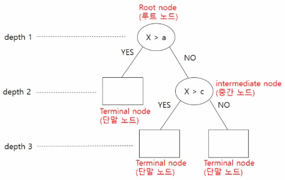
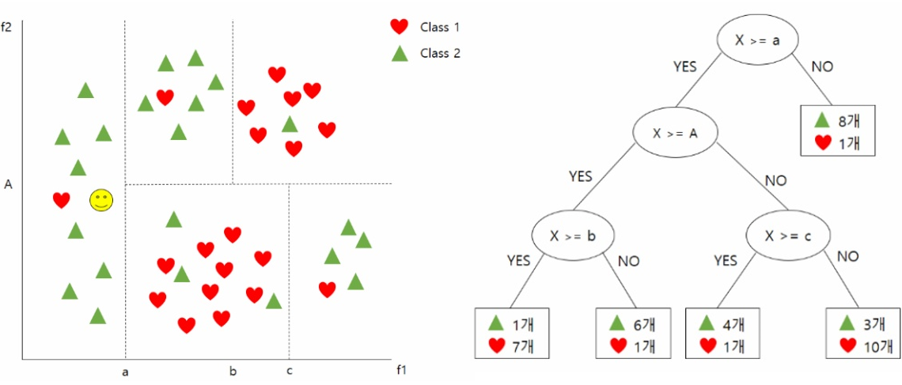
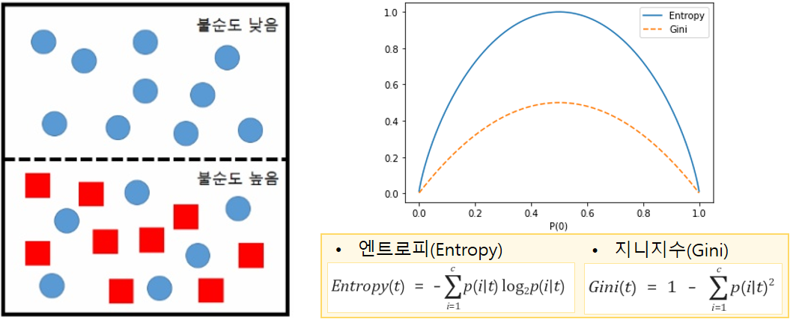

## 의사결정 나무(Decision Tree)

### Tree 기본 지식

* Root node : 최상위 노드
* Terminal node : 자식이 없는 노드 (단말 노드)
* Depth : 트리의 깊이

### 의사결정 나무

> 데이터를 분석해 이들 사이에 존재하는 패턴을 조합으로 나타내며 그 모양이 트리와 같은 알고리즘이다.

* 위의 예시는 Feature는 2개인 경우이며, 2차원 평면에 배치된 데이터들은 4개의 직선으로 분류한 경우이다.

※  알고리즘

1. Feature의 값을 기준으로 경계선을 나눈다.
2. 한번 분기할때마다 변수 영역을 두개로 구분한다.
3. 트리를 따라가면서 class를 분류한다.

* 트리구조로 경계선을 구분하면 차원이 높아져도 직관적으로 이해하기 쉬우므로 분류기법에 많이 사용된다.
* 다만, 경계선을 너무 많이 사용하면 트리의 구조가 복잡해지고 과잉 적합(Overfitting)의 우려가 발생한다.
* 과잉 적합의 문제를 해결하기 위해서는 사전/사후 가지치기(pruning) 방법을 사용한다.

### 불순척도와 최적의 분할 선택 기준(어떤 기준으로 영역을 나누는 것일까?)

* 각 노드의 불순척도 : 엔트로피(Entorpy), 지니지수(Gini)
* 불순척도가 작아지도록 순도가 높은 분할 기준을 선택한다.
* 분할 전 부모 노드의 불순척도보다 분할 후 자식의 불순척도가 낮을수록 좋다.(Information Gain)

### Decision Tree 특징

* 데이터의 차원이 높아져도 분류에 덜 중요한 Feature는 제외되므로 Feature 선정에 크게 신경쓸 필요가 없다.
* Feature마다 분류에 영향을 미치는 정도를 파악할 수 있다. -> 중요도 분석
* 과도하게 경계를 나눌경우 과적합(Overfitting)이 발생한다.
* 트리가 복잡해지고 과적합 문제를 개선하기 위해서는 트리가 더 이상 커지지 않도록하는 정지기준(Stopping Rule)과 가지치기(Pruning) 방법이 있다.
* 정지기준(Stopping Rule)은 트리의 깊이(Depth)를 지정하거나, 마지막 노드의 데이터 수가 임계치 이하로 떨어지지 않도록 지정하는 방법이 있다.
* 가지치기는 사전 가지치기(Pre-pruning)와 사후 가지치기(Post-Pruning)가 있다.

### 가지치기(Pruning)

* 트리가 너무 복잡해지지 않도록 단순화 시킨다.
* 평가용 데이터(Validation data)를 사용하여 일반화 특성이 좋아지는 지점에서 트리의 성장을 멈춘다.
* 사전 가지치기(pre-pruning)
  * 조기 정지 규칙에 의해 트리 성장을 멈춘다.
  * 정지 규칙으로는 트리의 깊이, 마지막 노드의 최소 데이터 수, 불순척도 등의 임계치를 이용하는 방법이 있다.
* 사후 가지치기(post-pruning)
  * 초기에는 트리를 최대의 크기로 만든다.
  * 마지막 노드의 불순척도가 최소가 되도록 분할한다. 복잡도가 최대가 된다.
  * Cross Validation(CV) 시험 오차가 최소가 되는 분할 수준으로 트리를 줄인다.

### Feature 중요도 분석

* Tree 분기가 완료된 후에 feature별로 얼마나 불순도를 감소시켰는지 평균 감소율(Feature IG합 / Feature의 등장 수)를 계산하면 Feature의 중요도를 판단할 수 있다.