# 근접이웃 알고리즘(KNN)

> 점 A 로부터 가까운 거리에 있는 K 개의 점을 선택한 후, K 개의 점들이 가장 많이 속한 클래스를 찾아 A가 그 클래스에 속한다고 평가하는 알고리즘

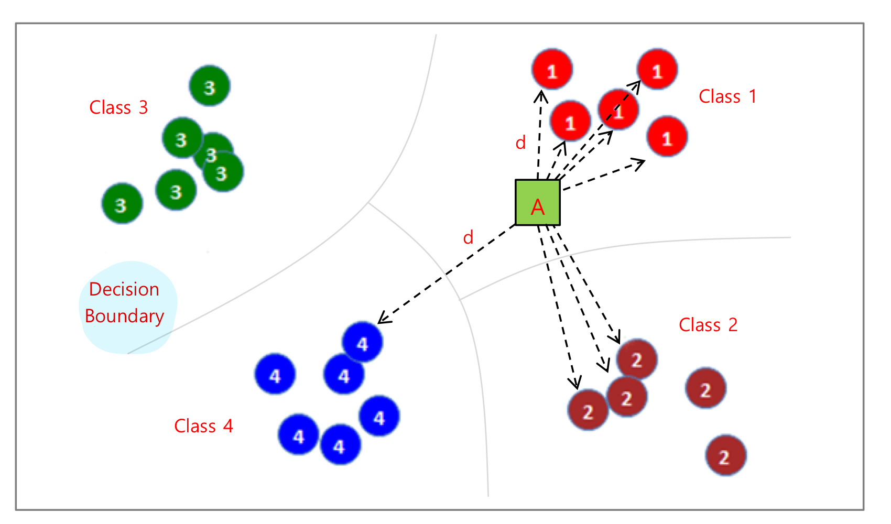

※ 알고리즘

1. 점 A와 기존의 data사이의 거리(d)를 측정한다.
   * 거리는 Manhattan distance / Euclidean distance / Minkowski distance를 사용하여 거리를 측정한다.
2. 측정한 거리가 작은 순으로 K개의 점을 찾는다.
3. K개의 점이 속한 클래스를 찾는다.
4. K개의 점이 속한 클래스가 가장 많은 클래스를 찾는다.
5. 점 A를 다수결의 원칙을 통해 클래스를 분류한다.
6. 시험 데이터로 평가한다.

### 거리 측정 기법

##### Manhattan distance

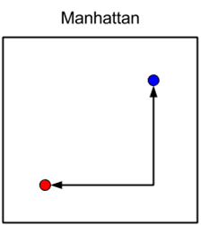

수식

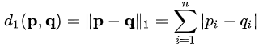

맨해튼 거리는 좌표축의 점 위에 x 성분의 길이의 합과 y 성분의 길이의 합이다.

위의 그림의 빨간 원의 좌표가 (-3, -1)이고 파란 원의 좌표가 (1, 2)인경우 

빨간 원에서 파란 원까지의 거리는 x 성분의 길이인 4와 y성분의 길이인 3의 합인 7이다.

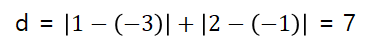

##### Euclidean distance

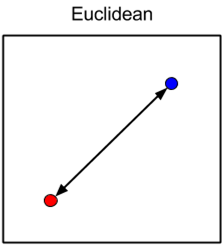

수식

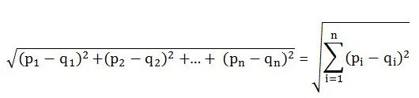

유클리디안거리는 두 점사이의 최단거리를 의미한다. 

위의 그림의 빨간 원의 좌표가 (-3, -1)이고 파란 원의 좌표가 (1, 2)인경우 

수식을 활용하여 빨간 원에서 파란 원의 최단 거리를 계산하면 5가 나온다.

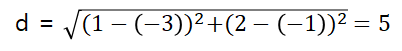

##### Minkowski distance

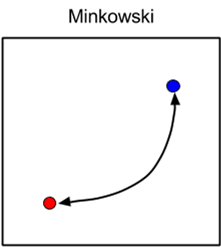

수식

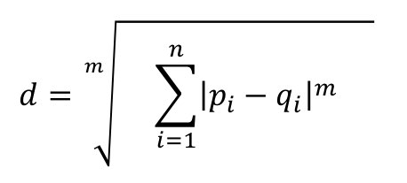

Manhattan 거리와 Euclidean 거리를 일반화 한 것이다.

Minkowski 거리는 각 성분의 길이 중 큰 길이에 중점을 두어 계산하는 방식이다.

위의 그림의 빨간 원의 좌표가 (-3, -1)이고 파란 원의 좌표가 (1, 2)인경우 

수식을 활용하여 빨간 원에서 파란 원의 Minkowski 거리를 계산하면 4.498이 나온다.

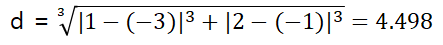

### KNN 차원의 저주

KNN 차원의 저주란 Feature의 개수가 많아지면 성능이 저하됨을 의미한다.

차원이 증가할수록 고차원 공간에 채울 데이터가 많이 필요하게 되고(빈 공간 발생), 근접 이웃을 기준으로 라벨을 정하는 KNN에서 "근접이웃"을 한정하기 어려워진다.

예를 들어 Feature의 개수가 3인 3차원 공간에서 테스트 데이터 주변의 훈련 데이터의 개수가 전체 데이터의 10%를 유지하려면,

한 변의 길이가 s = (0.1)^(1/3) = 0.464인 정육면체가 필요하다.

하지만 Feature의 개수가 10인 10차원 공간인 경우에는 한 변의 길이가 s = (0.1)^(1/10) = 0.8로 증가하므로, 근접이웃이 아닌 멀리있는 데이터를 참조해야하는 경우가 발생하므로 차원의 저주에 빠지지 않도록 조심해야한다.

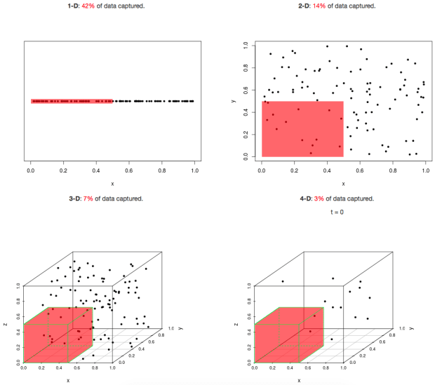

