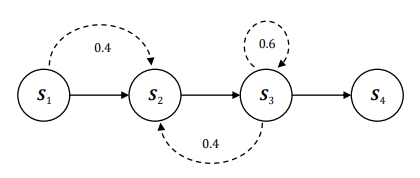
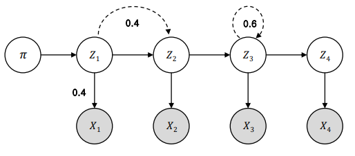
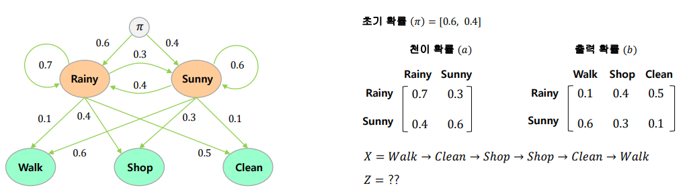

# 자연어 처리(Natural Language Processing)

> 자연어란 우리가 사용하는 언어를 의미하고 자연어처리란 자연어의 의미를 분석하여 컴퓨터가 처리할 수 있도록 하는 인공지능 주요 분야 중 하나이다.
>
> 현재, 문서 분류, 기계 번역, 질의 응답 시스템, 문서 요약, 문서 교정, 음성 인식, 대화 시스템, 사용자 감성 분석 등에 사용되는 분야이다.


### NLTK(Natutal Language Toolkit) 

> Python 언어로 개발된 자연어 처리 및 문석 분석용 패키지이며, NLTK가 제공하는 주요 기능은 말뭉치, 토큰 생성, 형태소 분석, 품사 태깅이 있다.
>
> [NLTK book link](https://www.nltk.org/book/)

#### 설치

``` bash
pip install nltk
(conda install nltk)
```

#### 데이터 다운로드

```python
import nltk
nltk.download()
```

* 아래와 같이 데이터 다운로드 진행


### 말뭉치(Corpus)

> 문서들의 집합을 의미한다.


NLTK를 사용해 코퍼스를 핸들링할 수 있다.

* corpus.fileids() : 새롭게 만든 말뭉치에 포함된 파일 리스트를 반환
* corpus.raw() : 말뭉치에 있는 '원천(raw)' 텍스트를 반환
* corpus.sents() :  모든 문장을 리스트로 반환
* corpus.words() : 모든 단어를 리스트에 넣어서 반환
* nltk.word_tokenize(text`(=corpus.raw())`) :  단어로 토큰화
* nltk.sent_tokenize(text`(=corpus.raw())`) :  문장으로 토큰화
* nltk.PorterStemmer() / nltk.LancasterStemmer() : 어간 추출
*  stopwords.words('english') : 영어 불용어
* nltk.FreqDist(text) : 입력 단어 목록에 매핑되는 단어와 해당 빈도가 포함된 걔체 반환
* wordnet.synsets(단어) :  유의어의 묶음
* wordnet.synsets(단어.품사.순번) :  단어.품사.순번(ex; tree.n.01)로 구성
* wordnet.synset(단어).lemmas() :  단어의 원형
* wordnet.synset(단어).hypernyms() : 단어의 상위어
* wordnet.synset(단어).hyponyms() :  단어의 하위어
* x.path_similarity(y) :  두 synset간(x, y)의 의미론적 유사도(0~1)
* 이 외의 함수는 [여기](https://moonnightfiction.tistory.com/entry/NLTK-02?category=779001)를 참고하면 잘 정리되어있다.


### 품사 태깅(Part of speech Tagging)

> 품사란 문장의 구성 성분을 의미한다. (한국어의 경우 8품사가 있다.) 
>
> 품사 태깅이랑 문장에 사용된 단어들에 알맞는 품사를 정하는 것을 의미한다.
>
> 품사 태깅의 목적은 "문장의 의미(semantic) 파악", "문법(syntax)에 맞는 문장을 생성"이다.


NLTK를 사용해 품사 태깅이 가능하다.

* nltk.pos_tag(word_token) : 튜플로 묶은 단어와 품사를 리스트로 반환


#### Markov Chain

>현재 상태(state)의 확률은 이전 상태에만 의존한다.



#### Hidden Markov Model

> 은닉 마코프 모델(HMM)은 각 상태(state)가 마코프 체인을 따르되 은닉(Hidden)되어 있는 것



* 예시를 위한 그림 (Markov 모델에 관련해 사용한 이미지의 [출처](#참고-문헌)는 아래에 있다.)




##### Forward-Backward 알고리즘

>전향-후향 알고리즘은 확률추정의 문제를 해결하기 위해 사용되는 알고리즘이다. 
>
>초기 확률(π), 천이확률(a), 출력확률(b)이 주어진 상황에서 관측 데이터 X 시퀀스가 나올 확률을 계산하는 알고리즘

관측데이터(X)가 Walk(`t-1`) -> Clean(`t`) 인 경우를 예를 들면, 

`t-1`인 경우

<span style = "background-color: #F5F6CE">Sunny -> Walk</span> : 0.4 x 0.6 = 0.24   // `t-1`이 맑고 걸을 확률 · · · ⓐ

<span style = "background-color: #E0F8F7">Rainy -> Walk</span> :  0.6 x 0.1 = 0.06  // `t-1`이 비가오고 걸을 확률 · · · ⓑ

`t`인 경우

`t-1`이 ⓐ 인 경우,

<span style = "background-color: #F5F6CE">Sunny -> Walk </span>-><span style = "background-color: #F8E0F1"> Rainy -> Clean</span> : 0.24 x 0.4 x 0.5 = 0.048  · · · ⓒ

<span style = "background-color: #F5F6CE">Sunny -> Walk </span>-> <span style = "background-color: #D8F6CE">Sunny -> Clean</span> : 0.24 x 0.6 x 0.1 = 0.0144  · · · ⓓ

ⓒ + ⓓ = 0.0624  


`t-1`이 ⓑ 인 경우,

<span style = "background-color: #E0F8F7">Rainy -> Walk</span> -> <span style = "background-color: #F8E0F1">Rainy -> Clean</span> : 0.06 x 0.7 x 0.5 = 0.021  · · · ⓔ

<span style = "background-color: #E0F8F7">Rainy -> Walk</span> -><span style = "background-color: #D8F6CE">Sunny -> Clean</span> : 0.06 x 0.3 x 0.1 = 0.0018  · · · ⓕ

ⓔ + ⓕ = 0.0228


∴ 관측데이터(X) : Walk -> Clean의 시퀀스가 나올 확률은 0.0624 + 0.0228 = 0.0852이다.

##### Viterbi decoding 알고리즘

>초기 확률(π), 천이확률(a), 출력확률(b), 관측데이터(X)가 주어신 상태에서 가장 가능성이 있는 히든상태(Z)의 시퀀스를 추정하는 알고리즘

관측데이터(X)가 Walk(`t-3`) -> Clean(`t-2`) -> Shop(`t-1`) -> Walk(`t`) 인 경우를 예를 들면, 

`t-3`인 경우

<span style = "background-color: #F5F6CE">Sunny -> Walk</span> : 0.4 x 0.6 = 0.24   // `t-1`이 맑고 걸을 확률 · · · ⓐ

<span style = "background-color: #E0F8F7">Rainy -> Walk</span> :  0.6 x 0.1 = 0.06  // `t-1`이 비가오고 걸을 확률 · · · ⓑ


`t-2`인 경우

`t-2`의 날씨가 <span style = "background-color: #F8E0F1">Rainy</span>인 경우

<span style = "background-color: #E0F8F7">Rainy -> Walk</span> -> <span style = "background-color: #F8E0F1">Rainy -> Clean</span> : 0.06 x 0.7 x 0.5 = 0.021  

<span style = "background-color: #F5F6CE">Sunny -> Walk </span>-><span style = "background-color: #F8E0F1"> Rainy -> Clean</span> : 0.24 x 0.4 x 0.5 = 0.048  · · · **max**

`t-2`의 날씨가 <span style = "background-color: #D8F6CE">Sunny </span>인 경우

<span style = "background-color: #F5F6CE">Sunny -> Walk </span>-> <span style = "background-color: #D8F6CE">Sunny -> Clean</span> : 0.24 x 0.6 x 0.1 = 0.0144  · · · **max**

<span style = "background-color: #E0F8F7">Rainy -> Walk</span> -><span style = "background-color: #D8F6CE">Sunny -> Clean</span> : 0.06 x 0.3 x 0.1 = 0.0018 


`t-1`인 경우

`t-1`의 날씨가 <span style = "background-color: #F6D8CE">Rainy</span>인 경우

<span style = "background-color: #F5F6CE">Sunny -> Walk </span>-><span style = "background-color: #F8E0F1"> Rainy -> Clean</span> -> <span style = "background-color: #F6D8CE">Rainy -> Shop</span> : 0.4 x 0.7 x 0.048  = 0.01344 · · · **max**

<span style = "background-color: #F5F6CE">Sunny -> Walk </span>-> <span style = "background-color: #D8F6CE">Sunny -> Clean</span>  -> <span style = "background-color: #F6D8CE">Rainy -> Shop</span> : 0.4 x 0.4 x 0.0144 = 0.002304

`t-1`의 날씨가 <span style = "background-color: #A9A9F5">Sunny </span>인 경우

<span style = "background-color: #F5F6CE">Sunny -> Walk </span>-><span style = "background-color: #F8E0F1"> Rainy -> Clean</span>  -> <span style = "background-color: #A9A9F5">Sunny -> Shop</span> : 0.3 x 0.3 x 0.048 = 0.00432 · · · **max**

<span style = "background-color: #F5F6CE">Sunny -> Walk </span>-> <span style = "background-color: #D8F6CE">Sunny -> Clean</span>  -> <span style = "background-color: #A9A9F5">Sunny -> Shop</span> : 0.3 x 0.6 x 0.0144 = 0.002592


`t`인 경우

`t`의 날씨가 <span style = "background-color: #D8D8D8">Rainy</span>인 경우

<span style = "background-color: #F5F6CE">Sunny -> Walk </span>-><span style = "background-color: #F8E0F1"> Rainy -> Clean</span> -> <span style = "background-color: #F6D8CE">Rainy -> Shop</span>  -> <span style = "background-color: #D8D8D8">Rainy -> Walk</span> : 0.1 x 0.7 x 0.01344 = 0.000941 · · · **max**

<span style = "background-color: #F5F6CE">Sunny -> Walk </span>-><span style = "background-color: #F8E0F1"> Rainy -> Clean</span>  -> <span style = "background-color: #A9A9F5">Sunny -> Shop</span>  -> <span style = "background-color: #D8D8D8">Rainy -> Walk</span> : 0.1 x 0.4 x 0.00432 = 0.000173

`t`의 날씨가 <span style = "background-color: #ADCBDF">Sunny </span>인 경우

<span style = "background-color: #F5F6CE">Sunny -> Walk </span>-><span style = "background-color: #F8E0F1"> Rainy -> Clean</span> -> <span style = "background-color: #F6D8CE">Rainy -> Shop</span>  -> <span style = "background-color: #ADCBDF">Sunny -> Walk</span> : 0.6 x 0.3 x 0.01344 = 0.002419 · · · <span style = "color: #FF0000">**max**</span>

<span style = "background-color: #F5F6CE">Sunny -> Walk </span>-><span style = "background-color: #F8E0F1"> Rainy -> Clean</span>  -> <span style = "background-color: #A9A9F5">Sunny -> Shop</span> -> <span style = "background-color: #ADCBDF">Sunny -> Walk</span> : 0.6 x 0.6 x 0.00432 = 0.001555


∴ 관측데이터(X) :  Walk -> Clean -> Shop -> Walk의 시퀀스가 나온 경우 

​     Z는 Sunny -> Rainy -> Rainy -> Sunny 가 0.2419%로 확률이 가장 높다.


##### Baum Welch 알고리즘

>관측데이터(X)만 주어진 경우 초기 확률(π), 천이확률(a), 출력확률(b), 히든상태(Z)를 추론하고 Z의 시퀀스를 찾아내는 알고리즘


### 참고 문헌

* 마코프 이미지 출처 : https://blog.naver.com/chunjein/221034077798

