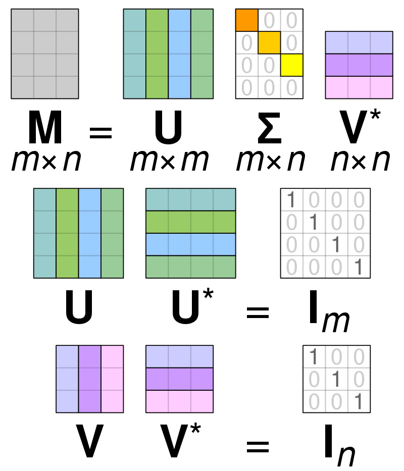
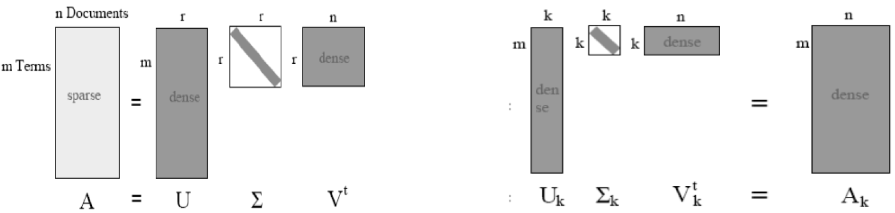
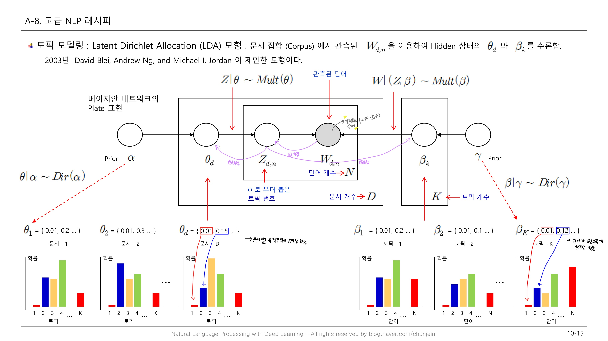

## 토픽모델(Topic Model)

### TF-IDF

> 단어의 빈도와 역 문서 빈도(문서의 빈도에 특정 식을 취함)를 사용해 DTM(TDM)내의 각 단어들마다 중요한 정도를 가중치로 주는 방법

* TF(단어 빈도, Term Frqeuency) : 특정 단어가 문서 내에 얼마나 자주 등장하는지 나타내는 값, TF값이 클수록 문서에서 중요한 단어임을 알 수 있다.
* IDF(역문서 빈도, Inverse Document Frequency) : DF(문서 빈도, Document Frequency) 값의 역수를 취한 값
* TF-IDF : TF와 IDF를 곱한 값으로 값이 클수록 다른 문서에는 많지 않고 해당 문서에서 자주 등장하는 단어임을 알 수 있다.

* TF-IDF 값이 높으려면, TF값은 높고 IDF값이 작으면 된다.

  즉, 다른 문서에선 잘 안나오는 `아이스크림`이라는 단어가 A문서에서 많이 등장한다면 A문서의 핵심단어는 `아이스크림`이다.

  

### SVD(특이값 분해)

> 임의의 `m x n`차원의 행렬 M에 대하여 다음과 같이 분해할 수 있다는 행렬 분해 방법 중 하나이다.

$$
M = UΣV^T
$$

* 직교행렬 : 자신과 자신의 전치행렬을 곱한경우 결과가 단위행렬이 되는 행렬
  $$
  AA^T = I
  $$

* U : m x m 크기를 가지는 직교행렬, (문서당 topic 분포, m(문서) x m(topic))

* Σ : m x n 크기를 가지며 대각선상에 있는 원소의 값은 음수가 아니며, 나머지 원소의 값은 모두 0인 대각행렬, 가장 중요한 원소를 

* V^T는 V의 켤레전치 행렬로, n x n의 직교행렬 (topic당 단어 빈도(분포), n(topic) x n(단어))

* 행렬  A를  위와 같은 3가지 행렬의 곱으로 나타내는 것을 M의 특이값 분해라고 한다.

### LSA 모형

> 문서들을 주제별로 클러스터링하는 알고리즘 

n개의 문서를 m개의 단어로 표현된 행렬 A가 있고, 이를 SVD(특이값 분해)를 사용해 U, Σ, V로 분해한다. 이때 Σ는 r개의 특이값을 갖게 되고, 사용자는 r보다 작은 k(topic의 개수)값을 지정한다. k개 만큼의 특이값만 남기고 k x k 크기를 갖는 ∑k가 만들어진다. 특이값을 분해하게 되면 ∑의 대각 원소는 상단부터 크기순으로 정렬되기때문에 k개만 남기고 자르면 가장 중요한 k개만 남게된다. 이와 같이 U와V행렬도 크기를 잘라준다.  
$$
A_k = U_kΣ_kV^t_k
$$
A_k는 위와 같은 식으로 만들어지게 되고 가장 중요한 토픽만 남게된다. 즉 불필요한 토픽은 제거된 잠재의미(주요 주제, 주요 단어)를 지닌다.

### LDA 모형

> 주어진 문서에 대하여 각 문서에 어떤 주제들이 존재하는지에 대한 확률모형
>
> LDA는 토픽별 단어의 분포, 문서별 토픽의 분포를 모두 추정해낸다. 이를 통해 ①단어가 특정 토픽에 존재할 확률과 ②문서에 특정 토픽이 존재할 확률을 결합확률로 추정하여 토픽을 추출한다. 

 

### 참고 문헌

* [LSA 이미지 출처](https://ratsgo.github.io/from%20frequency%20to%20semantics/2017/04/06/pcasvdlsa/)
* [LDA 이미지 출처](https://blog.naver.com/chunjein/220946362463)

