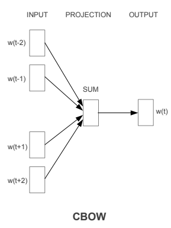
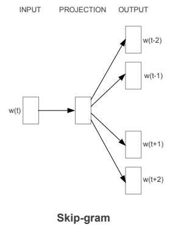
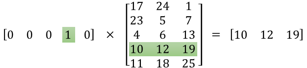
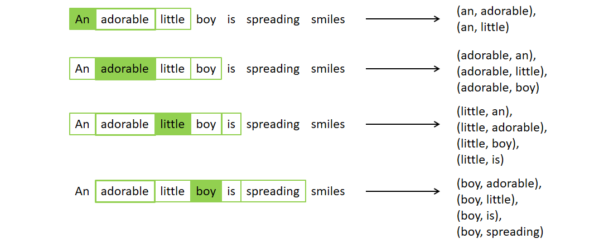

## Word2Vec

> 단어를 벡터로 바꿔주는 알고리즘

### CBOW

>주변 단어를 입력 받아 중심 단어 예측

### Skip-gram

> 중심 단어를 입력 받아 주변 단어 예측

* 입력으로 해당하는 단어를 입력하면 주변단어를 출력한다.
* 각 단어들은 ont-hot인코딩하여 입력되고 출력된다.
* 아래는 Skip-gram를 그림으로 나타낸 것이다.[이미지출처](https://ratsgo.github.io/from%20frequency%20to%20semantics/2017/03/30/word2vec/)

* V는 임베딩하려는 단어의 수, N은 은닉층 노드 수(사용자 지정)를 의미한다.
* W는 one-hot encoding된 입력벡터와 은닉층을 이어주는 **가중치행렬**임과 동시에 Word2Vec의 최종 결과물은 **임베딩 단어벡터의 모음**이다.
*  word2vec의 은닉층의 계산 방법은 가중치행렬W에서 해당 단어에 대한 행 백테를 참조(Lookup)하는 방식이다.

### N-gram

> 임의의 개수를 정하기 위한 기준을 위해 사용하는 것으로 n개의 연속적인 단어 나열을 의미한다.

* 문장 : An adorable little boy is spreading smiles
* unigrams : an, adorable,  little, boy, is, spreading, smiles
* bigrams :   (an adorable), (adorable little), (little boy), (boy is), (is spreading), (spreading smiles)
* trigrams : (an adorable little), (adorable little boy), (little boy is), (boy is spreading), (is spreading smiles)
* N-grams(4-grams) : (an adorable little boy), (adorable little boy is), (little boy is spreading), (boy is spreading smiles)

### Skip-gram 입력값과 정답

* 말뭉치 :  An adorable little boy is spreading smiles
* 윈도우(한번에 학습할 단어의 개수) 크기가 2인 경우 아래와 같이 입력과 정답이 생성된다.
* 윈도우 크기가 2이기 때문에 중심단어 앞뒤로 2개씩 본다.
* (an, adorable)의 경우 `an`이 입력으로 `adorable`이 정답으로 들어간다.

### Skip-Gram Negative Sampling(SGNS)

* skip gram에서는 softmax를 사용해 계산량이 많아진다는 단점을 보완한 방법이다.

* 사용자가 지정한 윈도우 크기내에 등장하지 않는 단어(negative sampling)를 뽑는다. 

* 이후 n-gram으로 선택한 단어쌍은 label을 1로 부여하고, 랜덤하게 선택된 단어 쌍에는 label을 0으로 부여해 이진분류로 만든다.

###  소스 코드

* [Skipgram(alice_in_wonderland)](https://github.com/Lee-JeongMin/TIL/blob/master/NLP/source_code/Skipgram.py)
* [SkipGramNegativeSampling(alice_in_wonderland)](https://github.com/Lee-JeongMin/TIL/blob/master/NLP/source_code/SkipgramNegativeSampling.py)
* SkipGramNegativeSampling(IMDB)
  * [dataProcess](https://github.com/Lee-JeongMin/TIL/blob/master/NLP/source_code/1.dataProcess.py)
  * [SGNS](https://github.com/Lee-JeongMin/TIL/blob/master/NLP/source_code/2.SGNS(network).py)
  * [Conv1D](https://github.com/Lee-JeongMin/TIL/blob/master/NLP/source_code/3.IMDB(Conv1D).py)

### 참고문헌

* [Word2Vec](https://arxiv.org/pdf/1301.3781.pdf)